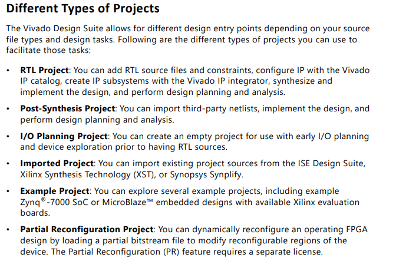
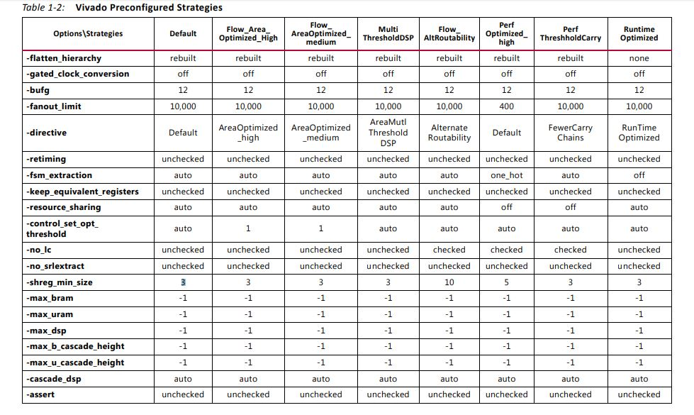

# Vivado Usage Part 2

## Types of Projects
- RTL Project: Most used; use when you are trying to create something scratch
- Imported Porject: Exxplained
- Example Project: Use a Xilinx template
- I/O Planning: First define IO then RTL
- Post Synthesis: Imprt a project where synthesis is already complete (useful for ASIC workflows)

### I/O Planning
To work with a team designing a custom board/device drivers.
- Can import XDC or CSV
- ONce I/O Planned, can migrate to RTL
- Constraints get specified before developing RTL.

### To Sum UP...


## Synthesis Settings
- USe the vivado "strategies", which enable:
- Area optimisation
- Resource optimisation
- Gated clock conversion: Optimises the design
```
// BAD PRACTICE (usually)
assign gated_clk = sys_clk & module_enable; 

always @(posedge gated_clk) begin
    // logic...
end
```
- fsm_extraction: Enables you to use a specific type of FSM inference (eg, you can ask the tool to prefer one-hot encoding)

These are based on Xilinx Designed optimisations.
## State Encoding Techniques
XST supports the following state encoding techniques.
### Auto
In this mode XST tries to select the best suited encoding algorithm for each FSM.

### One-Hot
One-hot encoding is the default encoding scheme. Its principle is to associate one code bit and also one flip-flop to each state. At a given clock cycle during operation, one and only one state variable is asserted. Only two state variables toggle during a transition between two states. One-hot encoding is very appropriate with most FPGA targets where a large number of flip-flops are available. It is also a good alternative when trying to optimize speed or to reduce power dissipation.

### Gray
Gray encoding guarantees that only one state variable switches between two consecutive states. It is appropriate for controllers exhibiting long paths without branching. In addition, this coding technique minimizes hazards and glitches. Very good results can be obtained when implementing the state register with T flip-flops.

### Compact
Compact encoding, consists of minimizing the number of state variables and flip-flops. This technique is based on hypercube immersion. Compact encoding is appropriate when trying to optimize area.

### Johnson
Like Gray, Johnson encoding shows benefits with state machines containing long paths with no branching.

### Sequential
Sequential encoding consists of identifying long paths and applying successive radix two codes to the states on these paths. Next state equations are minimized.

### User
In this mode, XST uses original encoding, specified in the HDL file. For example, if you use enumerated types for a state register, then in addition you can use the enum_encoding constraint to assign a specific binary value to each state.



## Implementation Strategies
### Power Opt
In Implementation settings, you can use "power_opt" to optimise power usage dsuring implementation. Enabling this m,ight help reduce the overall power as the vivado toolchain looks at logic from a power perspective.

There are other strategies you can explore via Settings > Implementation > Power etc.

## FPGA Design Flow
- Text Based: Using HDL language to describe blocks
- Graphics based: Block design based designing
- **Synthesis**: HDL to Primitives like blocks and cells. We also perform post functional synthesis. Mandoatory to have I/O planning here.
- **Implementation:** Adds the design on the FPGA tiles. Chooses the specific tiles and leafs here and assigns them the right numbers etc. Also perform a post implementation sim here.
- Generating a Bitfile

## Vivado Folder Hierarchy
The folders are arranged in the reverse order of the FPGA design flow:
- ### xyz.xpr: 
  The project file
- ### xyz.srcs: 
  Has all the design files including design, tb and xdc.
- ### xyz.sim: 
  All simulation data ( Nnot the sim tb code) will be here. Eg the behaviour sim, the functional sim, the post imp sim. The .wdb files here are the waveform files at each stage inside the repos of each sim type.
- ### xyz.runs
  See the .rpt files for utils, power, speeds etc.**You will also find the bitfiles and binfiles here.**
- ### xyz.ip_userfiles: 
  All the IP blocks related data here.
- ### xyz.hw
  The exported hardware images (like for petalinux)
- ### xyz.cache:
  Self explanatory

**You should not commit them all to git. Only src and xpr file should be on git, and MAYBE sim if needed. Put all else in gitignore.**
